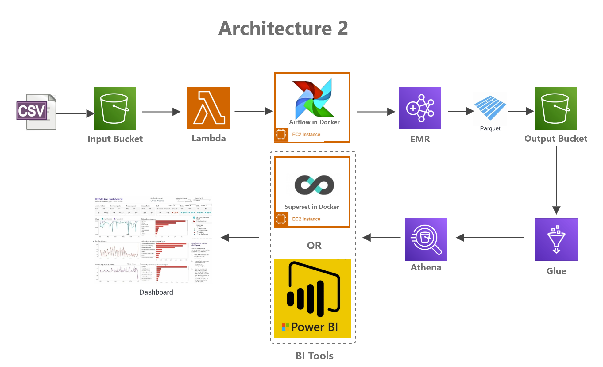

# nyc-taxi | Event-Driven architecture

# Overview

To build the event-driven pipeline within the AWS infrastructures.

- Where i got the data
    - I found the dataset through the Registry of Open Data on AWS.
        - AWS registry exists to help people discover and share datasets that are available via AWS resources
    - I chose New York City Taxi and Limousine Commission (TLC) Trip Record Data because it offers data from 2009 to 2023. It is well documented.
    - The data is offered in a parquet format.
    - Fields of the data can be found in this page: https://www.nyc.gov/assets/tlc/downloads/pdf/data_dictionary_trip_records_yellow.pdf
    
## Folder structures
- nyc-taxi-project
    - `data`
        - the data folder contains ingest and processed folder.
        - `ingest` folder has nyc taxi parquet files.
        - `processed` folder has transformed data from spark jobs.
    - `log`
        - any log information will be provided from EMR cluster after a job is submitted.
    - `python`
        - pyspark code is stored in this folder.
- Lambda
    - Triggers when ingestion is done from `nyc-taxi-project/data/ingest`
    - calls the Airflow API and passes the bucket name and key for the data ingestion.
- Airflow
    - a dockerized container in EC2
    - receives the bucket name and the key from Lambda and calls the EMROperator by using spark-submit
- Superset with Athena
    - a dockerized container in EC2
    - visualize the dataset with AWS Athena

## any other workflow explanation
- EMR
    - Runs the spark job and performs an ETL with the given file
    - spark-submit is used to trigger the job.
    - the spark code is stored under s3/python folder.
- Glue
    - manually runs the crawling to update the catalogue for Athena
- Athena
    - Athena can be run with the superset or manually run in the AWS service.

## Video Demo
- Ingestion and Airflow

https://github.com/kckoh/nyc-taxi/assets/43446639/b3db49c1-45ad-495c-ae23-ce84a7341fc6

- EMR
  
https://github.com/kckoh/nyc-taxi/assets/43446639/cba12ebb-fce1-4802-a17c-65d37e61cecb

- Crawling with Athena

https://github.com/kckoh/nyc-taxi/assets/43446639/fad67b95-0042-4217-bcc5-fad610e28373

